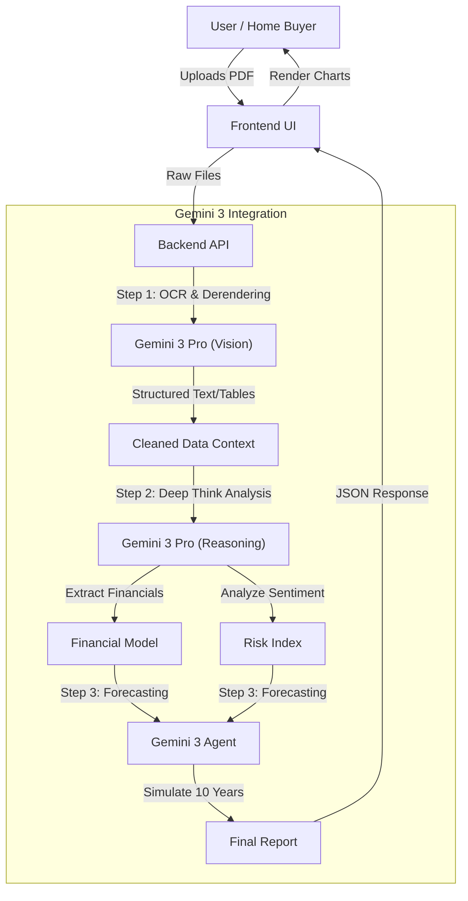

  

  <h1>StrataSleuth 🕵️‍♂️🏠</h1>
  <h3>The AI Conveyancer for the Weekend Buyer</h3>

  

    <strong>Turn dense 1,000-page strata reports into a 10-year financial forecast in seconds.</strong>
  

  

    <a href="https://youtu.be/YOUR_VIDEO_LINK">View Demo Video</a> •
    <a href="https://ai.studio/apps/drive/1FfqsURAst8mrB5JWXx3FDUL4saYMWNXy">Try it in AI Studio</a>
  

  
  
  

---

## 💡 Inspiration (Impact)
StrataSleuth was born out of a high-stress weekend during my own journey as a first-home buyer. I found a property I loved, but the seller demanded a signed contract by Monday morning. My conveyancer was offline for the weekend, and I was left staring at a 1,000-page strata report alone.

I realized that first-home buyers are at a massive disadvantage: we lack the experience to spot "ticking time bombs" in dense legal documents. I built StrataSleuth to ensure no one else has to make a million-dollar decision in the dark.

## 🚀 What it does (Innovation)
StrataSleuth is an AI-powered due diligence engine. Users upload dense strata reports and sales contracts, and the app uses **Gemini 3 Pro** to:

* **🚩 Flag Risks:** Instantly identifies hidden "special levies," litigious committee history, or restrictive by-laws (like "no pets") that traditional keyword searches miss.
* **📉 Audit Finances:** Extracts data from scanned PDF tables to verify if the sinking fund is actually healthy.
* **🔮 10-Year Forecast:** Generates a financial outlook tailored to the user:
    * **Owner-Occupier:** A "Rent vs. Buy" projection.
    * **Investor:** A "Wealth Accumulation" chart comparing long-term leases vs. Airbnb yields.

## ⚙️ How we built it (Technical Execution)
We leveraged the **Gemini 3 Pro API** as our central reasoning engine.

1.  **Multimodal Ingestion:** We used Gemini 3’s native `media_resolution: high` capability to "read" scanned, non-searchable PDFs directly, bypassing brittle OCR tools.
2.  **Deep Think Analysis:** To simulate a conveyancer's expertise, we used **Deep Think** mode. This allows the model to cross-reference historical maintenance notes (e.g., "roof leak reported 2019") with current financials to predict future capital works.
3.  **Agentic Forecasting:** We used Gemini as an agent to generate the 10-year financial models, writing and executing the calculation logic dynamically based on the specific building's data.

# Run and deploy your AI Studio app

This contains everything you need to run your app locally.

View your app in AI Studio: https://ai.studio/apps/drive/1FfqsURAst8mrB5JWXx3FDUL4saYMWNXy

## Run Locally

**Prerequisites:**  Node.js

1. Install dependencies:
   `npm install`
2. Set the `GEMINI_API_KEY` in [.env.local](.env.local) to your Gemini API key
3. Run the app:
   `npm run dev`

## Architecture Diagram

